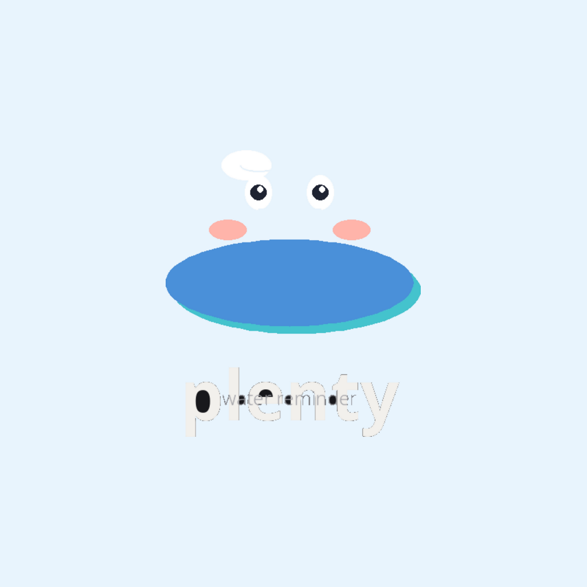

<p align="center">
  
</p>

<h1 align="center">💧 Plenty</h1>
<p align="center"><em>A water drinking reminder app built with React Native + Expo</em></p>

<p align="center">
  
  
  
</p>

---

## ✨ Features

- **⏰ Repeating reminders** — Notifications every 15m / 30m / 45m / 1h / 2h
- **💧 Quick log** — Tap "I drank water" to log 250ml with haptic feedback
- **📊 Today's progress** — See your glass count at a glance
- **📋 Drink history** — Full day log with timestamps
- **🌙 Quiet hours** — Suppress notifications during sleep
- **🔧 Dev Logs** — In-app console viewer for debugging

## 📸 Screenshots

| Home | Log | Settings | Dev Logs |
|------|-----|----------|----------|
| *coming soon* | *coming soon* | *coming soon* | *coming soon* |

## 🚀 Getting Started

### Prerequisites

- [Node.js](https://nodejs.org/) 18+
- [Expo Go](https://expo.dev/go) on your phone (Android or iOS)
- Or: [Android Studio](https://developer.android.com/studio) for emulator

### Install

```bash
git clone https://github.com/justinebacurin1927/Plenty.git
cd Plenty
npm install
```

### Run

```bash
npx expo start
```

Scan the QR code with **Expo Go** (Android) or the **Camera** app (iOS).

> **Note:** Push notifications don't work in Expo Go on Android SDK 53+. See [development builds](#-development-build) for full notification support.

## 🏗️ Project Structure

```
Plenty/
├── App.js                  # Root navigator (bottom tabs)
├── app.json                # Expo configuration
├── screens/
│   ├── HomeScreen.js       # Reminder controls + quick log
│   ├── LogScreen.js        # Today's drink history
│   ├── SettingsScreen.js   # Sound, quiet hours, reset
│   └── DevLogScreen.js     # In-app console viewer
├── components/
│   └── ErrorBoundary.js    # Crash catcher
├── utils/
│   ├── storage.js          # AsyncStorage (logs + settings)
│   ├── notifications.js    # Lazy-loaded notification helpers
│   └── logger.js           # Console interceptor
├── assets/                 # Icons, splash screen
└── SPRINT2.md              # Sprint 2 roadmap
```

## 🧪 Development Build

For **real notifications** (sound + vibration on Android), you need a development build APK instead of Expo Go.

```bash
npm install -g eas-cli
eas login
eas build:configure
eas build --platform android --profile development
npx expo start --dev-client
```

See [`SPRINT2.md`](SPRINT2.md) for the full roadmap.

## 📋 Roadmap

- [x] Sprint 1 — Core app (logging, settings, dev logs)
- [ ] Sprint 2 — Development build + real notifications
- [ ] Sprint 3 — Daily goal, custom amounts, weekly stats

## 🛠️ Built With

- [React Native](https://reactnative.dev/) — Framework
- [Expo](https://expo.dev/) — Toolchain
- [expo-notifications](https://docs.expo.dev/versions/latest/sdk/notifications/) — Local repeating notifications
- [AsyncStorage](https://react-native-async-storage.github.io/async-storage/) — Persistent storage
- [React Navigation](https://reactnavigation.org/) — Bottom tab navigation
- [@expo/vector-icons](https://docs.expo.dev/guides/icons/) — Ionicons

## 📄 License

MIT
