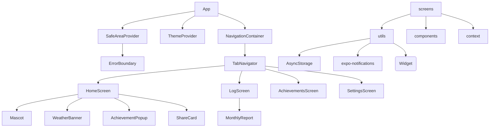
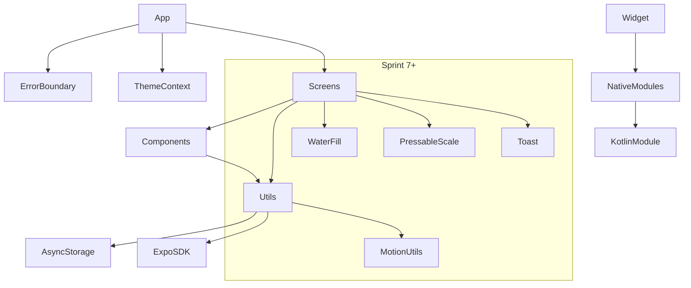
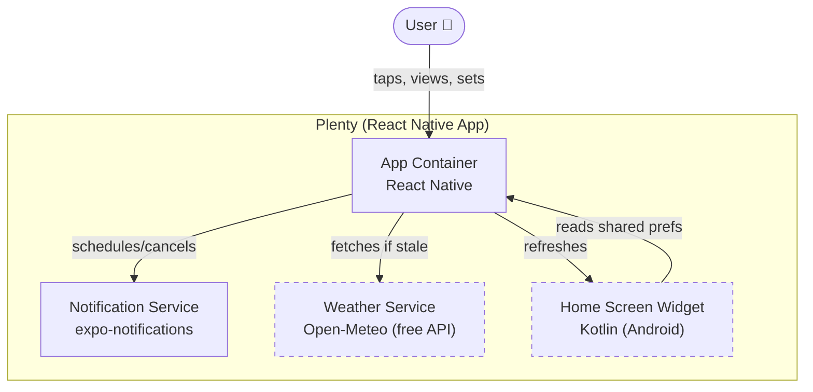

# Architecture Spine — Plenty

## Design Paradigm

**Screen-based React Native with utility modules.** No global state library — each screen imports the `utils/` functions it needs directly. Side effects (notifications, storage, weather fetches) are called from screens or utils, not mediated through a store. Theme is the only cross-cutting concern using `React.Context`.

The paradigm is intentionally simple: this is a single-user local-only app with no data synchronization, no multi-user state, and no complex routing. Adding Redux, Zustand, or a side-effect framework would be over-engineering.



## Invariants & Rules

### AD-1 — All-local by design

- **Binds:** all
- **Prevents:** accidental introduction of a server, backend, or cloud dependency
- **Rule:** Every feature must work offline with zero server infrastructure. No API keys, no push notification servers, no user accounts. Data persists exclusively in `@react-native-async-storage/async-storage`.

### AD-2 — Single-user, no accounts

- **Binds:** all
- **Prevents:** auth system, user profiles, multi-device sync, account recovery
- **Rule:** No login screen, no auth tokens, no user identity. The installing device *is* the user.

### AD-3 — Theme via React Context

- **Binds:** all screens and components that use color or spacing
- **Prevents:** prop-drilling theme state, duplicating dark/light logic per screen, unthemed color palettes
- **Rule:** `ThemeContext` (in `context/ThemeContext.js`) provides `{ isDark, colors, themeMode, setThemeMode }`. Every visual component consumes `colors` from `useTheme()`. Raw hex values are banned outside `constants/colors.js`. All color values — including data-visualization, semantic, and status colors — must be defined as theme tokens in both light and dark palettes within `constants/colors.js`. A color constant defined outside the theme (exported as a standalone named constant rather than added to the light/dark token objects) still violates this rule even if the hex literal itself lives in `colors.js`. Theme preference stored in AsyncStorage `@plenty_settings.themeMode`.

### AD-4 — Home screen owns notification state, notifications.js owns the schedule

- **Binds:** `screens/HomeScreen.js`, `utils/notifications.js`
- **Prevents:** multiple screens competing to start/stop reminders, notification schedule fragmentation across multiple entry points
- **Rule:** `notifications.js` is the sole module that calls `expo-notifications` APIs — it owns the complete notification schedule. `HomeScreen` is the only screen that triggers top-level scheduling (`scheduleWaterReminder()`, `cancelAllReminders()`). Notification scheduling logic lives entirely in `utils/notifications.js`. Any new scheduling function added to `notifications.js` must interact with the deduplication guard (AD-5) and be reviewed for schedule conflicts with existing triggers. Components must not call any scheduling function directly — they signal intent via props or callbacks to the parent screen, which decides whether to schedule. SettingsScreen reads/writes the `remindersActive` storage flag; `HomeScreen` polls this flag to decide whether to re-arm.

### AD-5 — Notification scheduling: single repeating trigger, single gate function

- **Binds:** `utils/notifications.js`
- **Prevents:** duplicate reminders, racing schedule calls, escalation scheduling conflicts, schedule fragmentation
- **Rule:** All notification scheduling must route through a single gate — currently `scheduleWaterReminder()` — that cancels all prior reminders before scheduling one. At most one repeating `TIME_INTERVAL` notification exists at any time. No new scheduling function in `notifications.js` may bypass this gate. Escalation (warning at 2h, alert at 4h) is computed at notification time via `getEscalationTier()`, not by scheduling additional notifications. Dedupe guard: concurrent calls to `scheduleWaterReminder()` always leave exactly one reminder — verified by Sprint 6 regression test (A5).

### AD-6 — AsyncStorage is the single data layer

- **Binds:** `utils/storage.js`, all consumers of persisted data
- **Prevents:** SQLite, Realm, MMKV, or a second storage engine unless load-bearing, shared-key shape drift
- **Rule:** All persistent state uses three AsyncStorage keys:
  - `@plenty_logs` — drink log entries (timestamp, amount, unit)
  - `@plenty_settings` — settings object (merged with `DEFAULT_SETTINGS` on read)
  - `@plenty_monthly_cache` — cached monthly report aggregations
  - *(Sprint 6 adds `@plenty_onboarded` flag)*
  - *(Sprint 6 adds `@plenty_reminders_active` flag)*

  Writes use the `save*` / `get*` helpers in `utils/storage.js`. Direct `AsyncStorage.getItem/setItem` outside `storage.js` is a code-review catch.
  
  **Key ownership — `@plenty_settings`:** All settings key additions must be registered in the single `DEFAULT_SETTINGS` object in `utils/storage.js`. No file outside `storage.js` may define its own defaults or extend the settings object independently. `getSettings()` merges `AsyncStorage` values against the canonical `DEFAULT_SETTINGS` — unknown keys (keys not in `DEFAULT_SETTINGS`) are stripped on write to prevent orphaned data and shape drift. If a new feature needs to add settings keys, it extends `DEFAULT_SETTINGS` in `storage.js` and accesses them via `getSettings()`.

### AD-7 — Native functionality via Expo modules and config plugins

- **Binds:** native bridges, builds
- **Prevents:** bare React Native eject, manual native project management
- **Rule:** All native platform code (widgets, modules) uses Expo's module system:
  - **Android widget:** Kotlin Expo module in `modules/plenty-widget/`. JS bridge in `utils/widget.js`
  - **Config plugins:** in `plugins/` (e.g., `withPlentyWidget.js`)
  - **Sprint 9 iOS widget:** WidgetKit via Expo config plugin (mirrors Android pattern)
  - No bare `.xcodeproj`/`.gradle` files outside the Expo-managed `android/`/`ios/` directories

### AD-8 — Weather: client-side cache, no server

- **Binds:** `utils/weather.js`, `components/WeatherBanner.js`
- **Prevents:** server-side weather service, API key in backend
- **Rule:** Weather data retrieved from Open-Meteo API (free, no key) via `expo-location`. Cached locally. No weather data leaves the device. User can fall back to manual city/zip in Settings if location permission denied.

### AD-9 — Health Connect purged before Play Store *(DONE)*

- **Binds:** `Story 1.3`
- **Prevents:** Data Safety form complication, unnecessary health permissions
- **Rule:** Remove `modules/plenty-health/`, `utils/health.js`, `expo-health-connect`, `react-native-health-connect` and associated autolink patches. Do not add any health-data declared permissions to the APK. *(Assumption: no plans to re-add Health Connect)*
- **Completed:** 2026-07-17 — all Health Connect files, deps, and patches removed.

### AD-10 — Bottom-tab navigation, 4 fixed screens

- **Binds:** `App.js`, screen definitions
- **Prevents:** deep navigation stacks, drawers, modals that replace the tab context [ASSUMPTION]
- **Rule:** `@react-navigation/bottom-tabs` with exactly 4 entries: Home, Log, Achievements, Settings. No nested navigators. Modals (achievement popup, amount picker) are RN `<Modal>` overlays, not navigation destinations. *(Sprint 6 adds an Onboarding screen routed conditionally before the tabs when `@plenty_onboarded` is falsy.)* For features too large for a component or a section within an existing screen, use a "sub-screen" pattern: a screen component managed by internal state in its parent tab screen (a state-driven view swap, not a navigation destination). Sub-screens live in `screens/sub/` and are imported and conditionally rendered by their parent tab screen. This preserves the 4-tab constraint while accommodating feature depth.

### AD-11 — Reanimated as the single animation layer (Sprint 7+)

- **Binds:** all new animation work from Sprint 7 onward
- **Prevents:** fragmented animation approaches, Skia, Lottie
- **Rule:** New animation: `react-native-reanimated`. Existing `Animated` code (Mascot.js bounce, AchievementPopup confetti) is grandfathered — migrate only if time allows. UI-thread animations (worklets) preferred over JS-thread. Reduced-motion (`useReducedMotion()` from `utils/motion.js`) disables non-essential animations.

### AD-12 — Adaptive reminders as opt-in engine (Sprint 8)

- **Binds:** Sprint 8 work
- **Prevents:** breaking the existing fixed-interval reminder behavior for existing users
- **Rule:** The adaptive interval engine (`utils/adaptive-scheduler.js` — new file) is a module behind a Settings toggle (`adaptiveMode: boolean`). Off → use `DEFAULT_SETTINGS.intervalMinutes` as today. On → compute interval from [glasses remaining / time left in active day], pattern-weighting, and bounds. Default for existing users: off. *(Deferred: actual heuristic design to be detailed in Sprint 8. This spine only fixes the shape it plugs into.)*

### AD-13 — iOS widget via Expo config plugin (Sprint 9)

- **Binds:** Sprint 9 — Epic B
- **Prevents:** bare Swift project management, divergence from Expo build pipeline
- **Rule:** iOS home-screen widget uses a WidgetKit Swift target scaffolded by an Expo config plugin (analogous to `withPlentyWidget.js` for Android). JS pushes data to an App Group via UserDefaults bridge. Design parity with the Android widget, adapted to iOS sizing conventions. *(Deferred: implementation detail to Sprint 9)*

## Consistency Conventions

| Concern | Convention |
|---|---|
| Naming (files) | `screens/`, `sub/`, `components/`, `utils/`, `constants/`, `context/`, `modules/`, `plugins/`. One concern per file. |
| Naming (exports) | Named exports for utils and components. Default export for screens. |
| Component contract | Components are presentational or compositive — they render UI and respond to props. They must not call scheduling functions, AsyncStorage APIs, or `expo-*` APIs directly. Screens are the sole layer that wires data fetching to components. |
| Utils module imports | Utils modules may import `storage.js`, `constants/`, and `context/` only. Cross-util imports between domain utils (e.g., `adaptive-scheduler.js` importing `notifications.js`) must be reviewed for dependency cycles and load-order sensitivity. No utils module may produce side effects at module scope. |
| Data format (logs) | `{ timestamp: number, amount: number, unit: "ml" }`. Timestamps are `Date.now()` ms. |
| Data format (settings) | Flat key-value object, merged with `DEFAULT_SETTINGS` on read. |
| Data format (dates) | ISO 8601 strings for display. `Date.now()` ms for storage comparison. |
| Error handling | Try/catch with `console.warn` fallback. ErrorBoundary at App root. Never crash on storage failure. |
| Logging | `utils/logger.js` captures `console.*` from boot. Dev Log screen (`DevLogScreen.js`) for debugging. |
| Platform branching | `Platform.select` or `Platform.OS === "android"` checks, not separate component files. |

## Stack

| Name | Version | Note |
|---|---|---|
| Expo SDK | ~55.0.0 | Current. Requires dev-client for native deps. |
| React Native | 0.83.6 | Bundled with Expo SDK 55. |
| React | 19.2.0 | |
| react-navigation/bottom-tabs | ^7.18.8 | Tab navigator |
| @react-navigation/native | ^7.3.8 | Core navigation; peer of bottom-tabs |
| @react-native-async-storage/async-storage | 2.2.0 | Single data layer |
| expo-notifications | ~55.0.24 | Local repeating notifications |
| expo-location | ~55.1.11 | Weather-aware reminders (Open-Meteo) |
| expo-dev-client | ~55.0.36 | Required for native dep builds |
| expo-sharing / expo-file-system / expo-document-picker | ~55.0.x | Data export/import |
| react-native-reanimated | *Sprint 7* | Animation foundation |
| react-native-svg | *Sprint 7* | Water-fill wave path |
| expo-haptics | *Sprint 7* | Tactile feedback |
| react-native-safe-area-context | ~5.6.2 | Notch/Dynamic Island insets |
| react-native-screens | ~4.23.0 | Native screen containers |
| react-native-view-shot | 4.0.3 | Share card capture |
| patch-package | ^8.0.1 | Dep patching |

## Structural Seed

### Source tree

```text
plenty/
├── App.js                      # Root: providers → tab navigator
├── app.json                    # Expo config
├── index.js                    # Entry point
├── package.json                # Dependencies
├── eas.json                    # EAS Build profiles
├── plugins/
│   └── withPlentyWidget.js     # Expo config plugin: Android widget
├── modules/
│   └── plenty-widget/          # Android widget (Kotlin Expo module)
├── constants/
│   └── colors.js               # Light + dark token palettes
├── context/
│   └── ThemeContext.js          # Theme provider + useTheme hook
├── components/
│   ├── Mascot.js               # Water droplet mascot (4 expressions × 4 variants)
│   ├── AchievementPopup.js     # Celebration modal with confetti
│   ├── MonthlyReport.js        # Collapsible report card
│   ├── WeatherBanner.js        # Heat advisory banner
│   ├── ShareCard.js            # Shareable streak card
│   └── ErrorBoundary.js        # Crash catcher
├── screens/
│   ├── HomeScreen.js           # Reminder controls, progress, quick-log
│   ├── LogScreen.js            # Drink history, charts, reports
│   ├── AchievementsScreen.js   # Achievement gallery
│   ├── SettingsScreen.js       # All settings
│   └── DevLogScreen.js         # Debug log viewer (dev-only)
├── utils/
│   ├── storage.js              # AsyncStorage CRUD
│   ├── notifications.js        # Permission, schedule, cancel, escalation
│   ├── achievements.js         # 12 achievement definitions + checker
│   ├── messages.js             # 30 notification messages in 7 categories
│   ├── reports.js              # Monthly/quarterly report generation
│   ├── patterns.js             # Peak hour, lull, day-of-week analysis
│   ├── weather.js              # Open-Meteo API, caching, heat adjustment
│   ├── export.js               # CSV/JSON export and import
│   ├── share.js                # Share card capture
│   ├── widget.js               # Android widget bridge
│   └── logger.js               # Console capture
└── docs/
    ├── project-context.md      # Canonical project summary
    ├── planning-artifacts/     # BMAD artifacts (PRDs, UX, architecture, epics)
    └── implementation-artifacts/ # Sprint status, stories, retrospectives
```

### Sprint 7+ additions

```text
utils/
└── motion.js                   # Animation presets + useReducedMotion hook
components/
├── WaterFill.js                # Animated SVG wave component
├── PressableScale.js           # Haptic + scale pressable wrapper
└── Toast.js                    # Log confirmation toast
```

### Sprint 8 additions

```text
utils/
└── adaptive-scheduler.js       # Adaptive interval engine
```

### Sprint 9 additions

```text
plugins/
└── withPlentyWidgetIOS.js      # Expo config plugin: iOS widget
modules/
└── plenty-widget-ios/          # iOS WidgetKit Swift module
```

### Dependency direction



### Context / Container diagram (C4 level 1)



## Capability → Architecture Map

| Capability | Lives in | Governed by |
|---|---|---|
| Reminder controls | `screens/HomeScreen.js` | AD-4, AD-5 |
| Notification scheduling | `utils/notifications.js` | AD-4, AD-5 |
| Drink logging | `screens/HomeScreen.js` → `utils/storage.js` | AD-6 |
| Goal tracking | `screens/HomeScreen.js` → `utils/storage.js` | AD-6 |
| Achievements | `screens/AchievementsScreen.js` + `utils/achievements.js` | AD-10 |
| Mascot | `components/Mascot.js` | — |
| Drink history & charts | `screens/LogScreen.js` | AD-6, AD-10 |
| Reports & patterns | `utils/reports.js`, `utils/patterns.js` | AD-6 |
| Weather integration | `utils/weather.js`, `components/WeatherBanner.js` | AD-8 |
| Settings | `screens/SettingsScreen.js` | AD-3 |
| Theme | `context/ThemeContext.js`, `constants/colors.js` | AD-3 |
| Data export/import | `utils/export.js` | AD-1 |
| Android widget | `utils/widget.js`, `modules/plenty-widget/` | AD-7 |
| Error handling | `components/ErrorBoundary.js` | conventions |
| Adaptive reminders | `utils/adaptive-scheduler.js` *(Sprint 8)* | AD-12 |
| Water fill animation | `components/WaterFill.js` *(Sprint 7)* | AD-11 |
| Motion/haptics | `utils/motion.js` *(Sprint 7)* | AD-11 |
| iOS widget | *(Sprint 9)* | AD-7, AD-13 |
| Onboarding | `screens/OnboardingScreen.js` *(Sprint 6)* | AD-10 |
| Testing | `__tests__/` *(Sprint 6)* | — |
| Play Store readiness | *(Sprint 6)* | AD-1, AD-9 *(DONE)* |

## Deferred

- **State management upgrade** — The current pattern (screens → utils) is adequate for 4 screens. If a future feature ever needs to share cross-screen state beyond what's already there (e.g., a live widget counter that updates from Log *and* Home), the permitted upgrade is a lightweight Zustand store in a new `stores/` directory. A Zustand store is a derived state cache only — AsyncStorage remains the single source of truth. Stores may read from utils on init but must not write to AsyncStorage directly. A single store instance per concern, not a proliferation. This remains deferred until a concrete cross-screen state need exists; do not adopt speculatively.
- **iOS notification channel mapping** — The Android escalation channel concept maps to iOS interruption levels. Detail deferred to Sprint 9, but the pattern (Platform.select in notification setup) is established.
- **Push notifications** — Deferred indefinitely. AD-1. If a future SPA/cloud feature ever needs them, use `expo-notifications` remote push with a lightweight token broker (Firebase + APNs via Expo), but the client architecture doesn't change — it's still the same notification handler, just with a remote trigger.
- **Desktop/web port** — Out of scope. Not deferred, not planned.
- **iPad/macOS Catalyst** — Deferred beyond Sprint 9. The design system (Sprint 7) should accommodate tablet layouts if reached.
- **WidgetKit iOS timeline refresh mechanism** — Specific mechanism deferred to Sprint 9. The architecture pattern (Expo config plugin + App Group bridge) is fixed by AD-7 and AD-13.
- **Adaptive reminder heuristic design** — Concrete algorithm (pacing model, pattern weighting formula, bounds) deferred to Sprint 8. The architecture shape (toggle-guarded module in `utils/`) is fixed by AD-12.
- **Sprint 7 nice-to-have animations** — Mascot idle bob migration to Reanimated, streak flame animation, pull-to-refresh, chart entrance animations. Deferred from core Sprint 7 to "time permitting" by party-mode discussion.
- **EAS Build profile for production AAB** — Specific `eas.json` configuration for Play Store AAB builds deferred to Sprint 6 Epic D. Use existing dev-client profile as base.
- **Testing strategy** — Sprint 6 adds `jest-expo` and unit tests for storage, notifications, patterns, and reports. Jest + `@testing-library/react-native` is the test framework. Integration and E2E testing strategy is deferred — no Detox, no Maestro, no CI pipeline defined at the architecture level. Testing is a Sprint 6 concern, not an architecture invariant. Revisit if E2E coverage becomes necessary for notification reliability.
